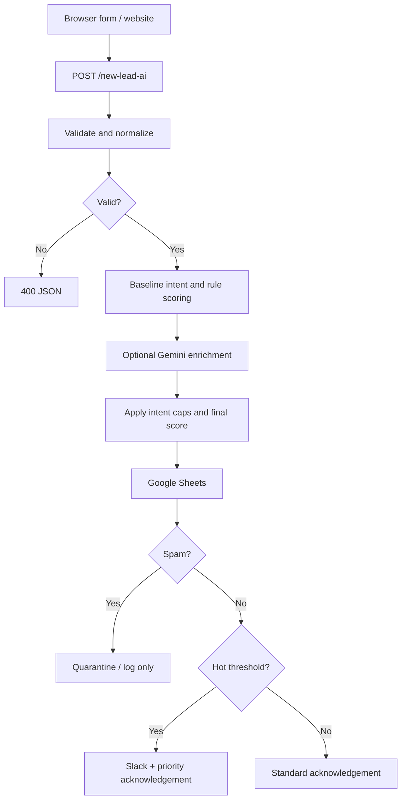

# Architecture

The included JSON implements webhook intake, field validation, deterministic baseline intent detection, scoring, and a JSON response. It does not include AI provider credentials or external side-effect nodes.

Suggested production extensions: add an LLM node with structured output; validate the output and clamp scores in code; append records to Google Sheets; route spam away from all outbound messaging; add Slack/Gmail nodes; and add idempotency plus error handling.
