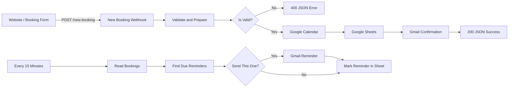

<div align="center">

# 📅 n8n Booking Automation: Calendar Confirmation & Appointment Reminders

### Automate website appointment bookings with webhook validation, Google Calendar event creation, Google Sheets booking records, Gmail confirmations, and scheduled 24-hour and 2-hour reminders.

**Keywords:** n8n booking workflow, appointment scheduling automation, Google Calendar integration, booking confirmation email, automated appointment reminders, Google Sheets booking system, and Gmail workflow automation.

<p>
  
  
  
  
  
</p>

<p>
  <a href="https://github.com/AbdullahSoftDev/n8n-automations">Automation Library</a> ·
  <a href="../">All Agents</a>
</p>

</div>

---

## 🎯 Overview

**Booking Confirmation & Automated Reminders** is a two-workflow n8n automation designed to handle the core lifecycle of an appointment from booking submission through pre-appointment reminders.

It combines:

**Website Booking → Validation → Google Calendar → Google Sheets → Confirmation Email → 24h / 2h Reminder Emails**

The supplied workflows are:

| Workflow | Trigger | Purpose |
|---|---|---|
| `booking-confirmation-calendar.json` | HTTP `POST` webhook | Validates a booking, creates a calendar event, stores it, emails the customer, and returns JSON |
| `booking-reminders.json` | Every 15 minutes | Checks confirmed bookings and sends due 24-hour or 2-hour reminders |

> **Result:** A booking can move from a website form to a confirmed calendar event and then through an automated reminder cycle without manual follow-up.

---

## ✨ What This Automation Solves

Manual appointment workflows often require someone to:

- read a website booking request
- check whether the submitted information is valid
- create a calendar event
- record the booking somewhere
- send a confirmation email
- remember to send reminders before the appointment

This automation connects those steps into a single system.

### Booking lifecycle

```text
Website Booking
      ↓
Webhook Intake
      ↓
Validate + Normalize
      ↓
Valid?
 ┌────┴────┐
 No        Yes
 ↓          ↓
400 JSON   Google Calendar
              ↓
        Google Sheets
              ↓
        Confirmation Email
              ↓
          Success JSON
              ↓
       Every 15 Minutes
              ↓
      Find Due Reminder
         ┌────┴────┐
        24h       2h
         ↓         ↓
      Reminder Email
         ↓
   Mark Reminder Sent
```

---

# 🔄 System Architecture



---

# 🧩 Workflow 1 — Booking Confirmation & Calendar

**File:** `workflow/booking-confirmation-calendar.json`

The booking workflow starts with an HTTP `POST` request to the `new-booking` webhook.

## Execution flow

| # | Node | What it does |
|---:|---|---|
| 01 | **New Booking Webhook** | Receives booking data through `POST /new-booking` |
| 02 | **Validate and Prepare** | Cleans fields, validates input, creates a Booking ID, and calculates start/end times |
| 03 | **Is Valid?** | Routes valid and invalid requests |
| 04 | **Create Calendar Event** | Creates an event on the Google Calendar `primary` calendar |
| 05 | **Save to Bookings Sheet** | Appends the confirmed booking to the `Bookings` sheet |
| 06 | **Send Confirmation Email** | Sends the customer a booking confirmation through Gmail |
| 07 | **Respond Success** | Returns HTTP 200 JSON |
| 08 | **Respond Error** | Returns HTTP 400 JSON with validation errors |

The workflow's webhook is configured for `POST`, uses `new-booking` as its path, and responds through a dedicated Respond to Webhook node.

---

## 📥 Booking Request Format

The workflow accepts these fields:

| Field | Required | Description |
|---|---|---|
| `name` | ✅ | Customer name |
| `email` | ✅ | Customer email |
| `phone` | Optional | Customer phone |
| `service` | Optional | Service / appointment type |
| `date` | ✅ | `YYYY-MM-DD` |
| `time` | ✅ | `HH:MM` |
| `duration` | Optional | Appointment length in minutes |
| `notes` | Optional | Additional booking notes |
| `website` | Optional | Honeypot field used for spam detection |

If `service` is empty, the workflow uses **Appointment**.

If `duration` is missing or invalid, the workflow defaults to **60 minutes**, with a minimum of **15** and maximum of **480 minutes**.

---

## 🛡️ Validation & Spam Protection

The `Validate and Prepare` node performs several checks before anything is created.

### Validation rules

- Name must be present.
- Email must match the workflow's basic email pattern.
- Date must use `YYYY-MM-DD`.
- Time must use `HH:MM`.
- The requested time must be in the future.
- A non-empty `website` honeypot field causes validation to fail.

Invalid requests do **not** create calendar events or booking records.

Instead, the workflow returns:

```json
{
  "success": false,
  "errors": [
    "Name is required."
  ]
}
```

with HTTP status **400**.

---

## 🆔 Booking IDs

Every valid booking receives a generated ID in the form:

```text
BK-XXXXXXXX
```

The ID is generated from the current timestamp and converted to uppercase base-36.

Example:

```text
BK-MH7K2P4
```

This ID is then used to identify the booking across the Google Sheet, confirmation email, and calendar event description.

---

## 🕐 Timezone Handling

The workflow explicitly operates using:

```text
Asia/Karachi
UTC+5
No daylight saving
```

The submitted date/time is parsed as Pakistan local time.

The workflow then produces:

- `startLocal`
- `startISO`
- `endISO`
- `startDisplay`

The displayed appointment time is formatted for customer-facing emails using the `Asia/Karachi` timezone.

> **Important:** The current workflow is intentionally configured for the business timezone `Asia/Karachi`. If the business operates elsewhere, update the timezone logic in the Code nodes.

---

# 📆 Google Calendar Integration

For valid bookings, the workflow creates an event on the connected Google Calendar **primary** calendar.

### Calendar event

**Summary**

```text
<Service> - <Customer Name>
```

### Description

The event contains:

- Booking ID
- Phone
- Email
- Notes

The customer email is also added as an attendee, and calendar updates are configured to be sent to attendees.

---

# 📊 Google Sheets Booking Database

After the calendar event is created, the workflow appends the booking to the `Bookings` sheet.

## Recommended headers

Create a Google Sheet tab named:

```text
Bookings
```

with these columns:

```text
Booking ID
Created At
Name
Email
Phone
Service
Start
Status
Reminder 24h
Reminder 2h
Calendar Event ID
Notes
```

### Example record

| Booking ID | Name | Service | Start | Status | Reminder 24h | Reminder 2h |
|---|---|---|---|---|---|---|
| `BK-ABC123` | Sara Khan | Consultation | `2026-10-10 14:00` | Confirmed | Sent ... | Sent ... |

The workflow initially writes:

```text
Status = Confirmed
Reminder 24h = empty
Reminder 2h = empty
```

The calendar event ID is stored in the same row.

---

# 📧 Confirmation Email

Once the booking is saved, Gmail sends a confirmation email to the submitted address.

The message includes:

- Customer name
- Service
- Appointment date/time
- Booking ID
- Notice that a calendar invite and reminders will follow
- Cancellation/rescheduling instruction

The email uses the connected Gmail account and does not append n8n attribution.

---

# 🌐 API Response

### Successful booking

The workflow returns HTTP **200**:

```json
{
  "success": true,
  "bookingId": "BK-ABC123",
  "when": "Sat, 10 Oct 2026, 2:00 pm"
}
```

### Invalid booking

The workflow returns HTTP **400**:

```json
{
  "success": false,
  "errors": [
    "A valid email is required.",
    "Please choose a time in the future."
  ]
}
```

---

# ⏰ Workflow 2 — Automated Reminder Engine

**File:** `workflow/booking-reminders.json`

The reminder workflow runs automatically every **15 minutes**.

## Execution flow

| # | Node | What it does |
|---:|---|---|
| 01 | **Every 15 Minutes** | Starts the reminder scan |
| 02 | **Read Bookings** | Reads booking records from Google Sheets |
| 03 | **Find Due Reminders** | Filters confirmed future bookings and decides whether a reminder is due |
| 04 | **Send This One?** | Allows only reminders marked for sending to continue |
| 05 | **Send Reminder Email** | Emails the customer |
| 06 | **Mark Reminder in Sheet** | Records the reminder state |

---

# 🧠 Reminder Logic

The reminder engine is deliberately deterministic.

It checks:

1. Does the row have a Booking ID?
2. Is the booking status `Confirmed`?
3. Can the appointment start time be parsed?
4. Is the appointment still in the future?
5. Has the relevant reminder already been sent?
6. Is the booking inside the 24-hour or 2-hour reminder window?

### Reminder windows

| Reminder | Condition |
|---|---|
| **24-hour** | More than 2 hours and up to 24 hours before appointment |
| **2-hour** | Up to 2 hours before appointment |
| Already sent | No new email |
| Past appointment | Ignored |
| Non-confirmed booking | Ignored |

---

## 🔥 Important 24h / 2h Behavior

The workflow handles short-notice bookings specially.

If a booking was created **less than 24 hours before the appointment**, the 24-hour reminder is marked:

```text
Skipped
```

The customer can still receive the **2-hour reminder** when that window is reached.

This prevents the system from pretending that a 24-hour reminder was possible when the booking itself was made too late.

---

# 🔁 Reminder State Tracking

The reminder workflow writes timestamps into the booking row.

Example:

```text
Reminder 24h → Sent 2026-10-07T12:00:00.000Z
Reminder 2h  → Sent 2026-10-08T00:00:00.000Z
```

For a short-notice booking:

```text
Reminder 24h → Skipped
Reminder 2h  → Sent 2026-10-07T14:00:00.000Z
```

Because the workflow checks these columns before sending, the same reminder is not intentionally sent repeatedly on every 15-minute scan.

---

# 🧮 Reminder Decision Example

Suppose a confirmed appointment is scheduled for:

```text
10 Oct 2026 — 2:00 PM
```

### More than 24 hours away

```text
No reminder
```

### Between 24h and 2h

```text
24h reminder → send once
```

### Within 2 hours

```text
2h reminder → send once
```

### Appointment passed

```text
Ignore
```

---

# 🔗 End-to-End Booking Lifecycle

```text
┌─────────────────────────────┐
│      Customer submits       │
│       booking form         │
└──────────────┬──────────────┘
               ↓
        POST /new-booking
               ↓
┌─────────────────────────────┐
│ Validate + normalize data   │
└──────────────┬──────────────┘
               ↓
          Is valid?
          /       \
        No         Yes
        ↓           ↓
    400 JSON    Create Calendar
                    ↓
              Save to Sheets
                    ↓
            Confirmation Email
                    ↓
              Booking Confirmed
                    ↓
           Reminder Scheduler
            (every 15 min)
                    ↓
             Check due time
              /          \
            24h           2h
             \            /
              ↓          ↓
             Reminder Email
                    ↓
             Update Sheet
```

---

# 🧪 Demo

The repository includes:

```text
demo/
└── booking-form.html
```

The form demonstrates a simple browser-based booking request.

It submits:

- Name
- Email
- Phone
- Service
- Date
- Time
- Duration
- Notes
- Honeypot spam field

### Configure the demo

Open:

```text
demo/booking-form.html
```

and set:

```javascript
const WEBHOOK_URL = 'http://localhost:5678/webhook/new-booking';
```

For a deployed n8n instance, replace this with the production webhook URL.

> The supplied n8n workflow currently allows all origins (`*`). That is convenient for a demo but should be restricted before production deployment.

---

# 🧪 Test With cURL

```bash
curl -X POST "http://localhost:5678/webhook/new-booking" \
  -H "Content-Type: application/json" \
  -d '{
    "name": "Sara Khan",
    "email": "sara@example.com",
    "phone": "+92 300 1234567",
    "service": "Consultation",
    "date": "2026-10-10",
    "time": "14:00",
    "duration": 60,
    "notes": "Initial consultation"
  }'
```

### Expected response

```json
{
  "success": true,
  "bookingId": "BK-XXXXXXXX",
  "when": "Sat, 10 Oct 2026, 2:00 pm"
}
```

---

# 🧪 Test With PowerShell

```powershell
$body = @{
  name = "Sara Khan"
  email = "sara@example.com"
  phone = "+92 300 1234567"
  service = "Consultation"
  date = "2026-10-10"
  time = "14:00"
  duration = 60
  notes = "Initial consultation"
} | ConvertTo-Json

Invoke-RestMethod `
  -Method Post `
  -Uri "http://localhost:5678/webhook/new-booking" `
  -ContentType "application/json" `
  -Body $body
```

---

# ⚙️ Setup

<details>
<summary><strong>1. Start n8n</strong></summary>

If using a local installation:

```bash
npx n8n
```

Then open:

```text
http://localhost:5678
```

</details>

<details>
<summary><strong>2. Import both workflows</strong></summary>

Import these files into n8n:

```text
workflow/booking-confirmation-calendar.json
workflow/booking-reminders.json
```

The workflows are independent but share the same Google Sheets booking database.

</details>

<details>
<summary><strong>3. Configure Google Calendar</strong></summary>

Connect a Google Calendar credential in the **Create Calendar Event** node.

The supplied workflow targets:

```text
primary
```

calendar.

</details>

<details>
<summary><strong>4. Configure Google Sheets</strong></summary>

Create a spreadsheet with a tab named:

```text
Bookings
```

Use the headers documented above.

Connect the Google Sheets credential in both workflows.

</details>

<details>
<summary><strong>5. Configure Gmail</strong></summary>

Connect Gmail credentials to:

- `Send Confirmation Email`
- `Send Reminder Email`

Replace:

```text
YOUR BUSINESS NAME
```

with the actual business name.

</details>

<details>
<summary><strong>6. Configure the webhook</strong></summary>

Use the test webhook while developing.

For production, activate the workflow and use the production URL:

```text
https://YOUR-N8N-DOMAIN/webhook/new-booking
```

</details>

---

# 🔐 Credentials & Configuration

The workflow JSON contains references to a Google Sheet and service configuration, but credentials should be managed through n8n's credential system.

Before committing or deploying:

- connect Google Calendar credentials
- connect Google Sheets credentials
- connect Gmail credentials
- replace business-specific email text
- verify the target spreadsheet
- verify the target calendar
- verify the production webhook URL

> **Never commit OAuth secrets, API keys, passwords, private tokens, or exported credential data to Git.**

---

# 🔒 Security & Production Considerations

The supplied workflows are suitable as a portfolio/demo foundation, but public deployment should be hardened.

### Recommended production improvements

- Restrict webhook CORS to trusted origins.
- Add authentication or a signed request mechanism.
- Add rate limiting.
- Keep the honeypot spam check.
- Add CAPTCHA or bot protection.
- Validate service values against an allow-list.
- Add business-hours and availability checks.
- Prevent overlapping bookings.
- Add cancellation/rescheduling workflows.
- Add error handling and failure alerts.
- Protect customer information in logs.
- Use separate development and production credentials.
- Monitor failed Google Calendar, Sheets, and Gmail operations.

### Important availability limitation

The supplied booking workflow validates that a requested time is in the future, but it does **not** check whether that time is already occupied.

Therefore, this workflow should not be described as a complete availability-management system unless an availability/conflict check is added.

---

# ⚠️ Known Limitations

| Area | Current behavior |
|---|---|
| Availability | Future time is validated, but existing calendar conflicts are not checked |
| Timezone | Hard-coded to `Asia/Karachi` / UTC+5 |
| CORS | Webhook currently allows `*` |
| Spam protection | Honeypot only |
| Booking changes | No cancellation/rescheduling workflow |
| Reminders | Email only |
| Reminder scheduler | Runs every 15 minutes |
| CRM | Google Sheets is used instead of a dedicated CRM |
| AI | No AI classification or generation is used |
| Business hours | Not enforced |
| Overlapping bookings | Not prevented by the supplied workflow |

---

# 🚀 Possible Improvements

### Booking intelligence

- 📅 Google Calendar availability lookup
- 🚫 Conflict prevention
- 🕐 Business-hour validation
- 🌍 Multi-timezone support
- 🧑‍💼 Staff/resource-specific calendars
- 🔄 Rescheduling and cancellation endpoints

### Communication

- 📱 WhatsApp reminders
- 💬 SMS reminders
- 📧 Custom reminder templates
- 🔁 Follow-up after missed appointments
- 🔔 Internal Slack notifications

### CRM

- 🗂️ HubSpot integration
- ☁️ Salesforce integration
- 📊 Airtable or Notion
- 🏷️ Customer lifecycle tracking
- 📈 Booking analytics

### Reliability

- 🚨 Error workflow
- 🔁 Retry strategy
- 📋 Audit logs
- 🧪 Automated test payloads
- 🔐 Signed webhook requests

---

# 📁 Project Structure

```text
Booking and Reminder Automation/
│
├── workflow/
│   ├── booking-confirmation-calendar.json
│   └── booking-reminders.json
│
├── demo/
│   └── booking-form.html
│
├── docs/
│   ├── architecture.md
│   └── setup.md
│
├── .gitignore
└── README.md
```

---

# 📚 Documentation

Additional documentation is available in:

- [`docs/architecture.md`](docs/architecture.md)
- [`docs/setup.md`](docs/setup.md)

The workflow JSON files are directly importable into n8n after credentials and environment-specific settings are configured.

---

# 📊 Automation Value

```text
                    BEFORE
┌─────────────────────────────────────────┐
│ Form → Manual check → Calendar → Email │
│                         ↓               │
│                  Manual reminders       │
└─────────────────────────────────────────┘

                    AFTER
┌─────────────────────────────────────────┐
│ Booking Form                             │
│      ↓                                   │
│ Validation                               │
│      ↓                                   │
│ Calendar + Booking Database              │
│      ↓                                   │
│ Confirmation Email                       │
│      ↓                                   │
│ Automated 24h / 2h Reminder Engine      │
└─────────────────────────────────────────┘
```

The main value is not just sending emails. It is **connecting booking intake, calendar scheduling, record keeping, confirmation, and reminder state into one automated lifecycle**.

---

# 👨‍💻 Author

<div align="center">

### Muhammad Abdullah

**Full-Stack Developer · AI Applications · Automation**

<a href="https://github.com/AbdullahSoftDev">GitHub</a> ·
<a href="https://linkedin.com/in/abdullahsoftdev">LinkedIn</a>

</div>

---

<div align="center">

**Part of the n8n Automation Agents collection.**

⭐ Explore the repository for more automation workflows.

</div>
