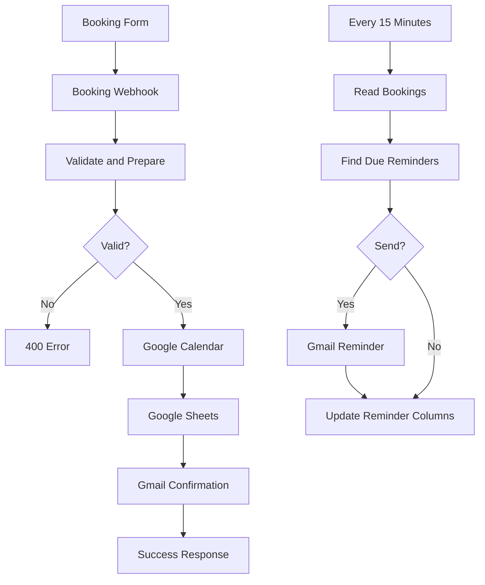

# Architecture

## Two-workflow design

## Shared state

The Google Sheet is the shared state between the workflows.

The booking workflow creates a confirmed row with empty reminder fields.

The reminder workflow reads those rows and writes:

- `Sent <ISO timestamp>` when a reminder is sent
- `Skipped` for the 24-hour reminder when the booking was made less than 24 hours ahead

## Booking data

The booking workflow produces:

- `bookingId`
- `createdAt`
- `name`
- `email`
- `phone`
- `service`
- `notes`
- `duration`
- `startLocal`
- `startISO`
- `endISO`
- `startDisplay`

## Reminder decision

The reminder Code node:

1. ignores rows without a Booking ID
2. ignores non-confirmed bookings
3. parses the start time as Asia/Karachi
4. ignores past appointments
5. checks existing reminder state
6. selects a 24h or 2h reminder
7. generates a customer-facing display time
8. passes the state to the email/update nodes

## Availability caveat

The supplied booking workflow does not query Google Calendar for conflicts before creating an event. A production implementation should add an availability/conflict check if double-booking must be prevented.
