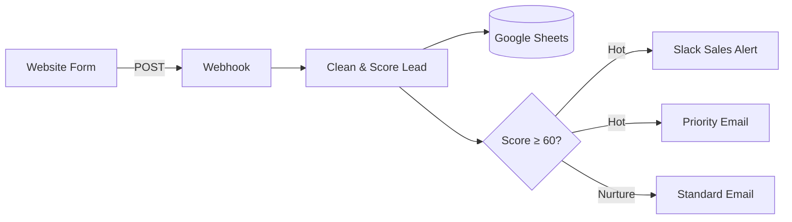

<div align="center">

# 🎯 n8n Lead Capture, Lead Scoring & Automated Follow-up

### Automate website lead capture, rule-based lead scoring, Google Sheets CRM logging, Slack sales alerts, and Gmail follow-up with n8n.

**Keywords:** n8n lead generation workflow, lead qualification automation, lead scoring workflow, website form webhook, Google Sheets CRM automation, Slack sales notifications, and automated email follow-up.

<p>
  
  
  
  
</p>

<p>
  <a href="https://github.com/AbdullahSoftDev/n8n-automations">Automation Library</a> ·
  <a href="../">All Agents</a>
</p>

</div>

---

## 🎯 Overview

**Lead Capture, Scoring & Follow-up** is an end-to-end n8n automation that turns a website inquiry into an immediately processed lead.

The workflow receives a lead through a webhook, cleans the submitted data, calculates a **0–100 lead score**, records the lead in Google Sheets, identifies high-value opportunities, alerts the sales team through Slack, and automatically sends the appropriate email response.

> **Result:** Less manual triage, faster responses, and a clear priority for the sales team.

## 💡 The Business Problem

When website inquiries are handled manually, businesses commonly face three problems:

- Leads can remain unanswered for too long.
- Sales teams spend time manually deciding which leads deserve priority.
- Important context is scattered across forms, inboxes, and spreadsheets.

This automation creates a simple pipeline:

**Capture → Clean → Score → Log → Prioritize → Alert → Respond**

## 🔄 Workflow



### Execution flow

| Step | Action | Outcome |
|---|---|---|
| 01 | **Webhook** | Receives name, email, company, and message |
| 02 | **Code** | Cleans the input and calculates a 0–100 score |
| 03 | **Google Sheets** | Stores the lead, score, and status |
| 04 | **IF** | Routes the lead based on score |
| 05 | **Slack** | Alerts the sales team for hot leads |
| 06 | **Email** | Sends a priority or standard response |

## 🧠 Lead Scoring

The scoring engine is deliberately **rule-based**, making it transparent, predictable, and easy to customize.

| Signal | Points |
|---|---:|
| Company name provided | +20 |
| Business email domain | +25 |
| Message longer than 80 characters | +15 |
| Buying-intent keywords | +15 each |
| Maximum keyword bonus | +40 |
| **Maximum score** | **100** |

### Lead classification

- 🔥 **Hot** — score **60 or higher**
- 🌱 **Nurture** — score **below 60**

Buying-intent keywords include terms such as `quote`, `pricing`, `budget`, `demo`, `urgent`, and similar signals.

## 🧩 Integrations

| Integration | Role |
|---|---|
| **n8n** | Workflow orchestration |
| **Webhook** | Lead intake |
| **Google Sheets** | Lead database / logging |
| **Slack** | Sales-team notifications |
| **Gmail** | Automated lead responses |
| **HTML / JavaScript** | Demo contact form |

## 📁 Project Structure

```text
Lead Capture, Scoring and Follow-up/
│
├── workflow/
│   └── lead-capture-workflow.json   # Importable n8n workflow
├── demo/
│   └── contact-form.html             # Example website form
├── docs/
│   └── screenshots / demo assets
└── README.md                         # Documentation
```

## ⚙️ Setup

### Prerequisites

- A running n8n instance.
- A Google account with access to Google Sheets and Gmail.
- A Slack workspace where the automation can post messages.
- A Google Sheet for lead storage.

The workflow was built and tested on a **self-hosted n8n instance**.

### 1. Start n8n

```bash
npx n8n
```

Then open `http://localhost:5678`.

### 2. Create the Google Sheet

Create a sheet with a tab named `Leads` and these headers:

```text
Received At | Name | Email | Company | Message | Score | Status
```

### 3. Import the workflow

Import `workflow/lead-capture-workflow.json` into your n8n instance.

### 4. Configure credentials

**Google Sheets / Gmail**
- Create or configure an OAuth application in Google Cloud.
- Enable the required Google APIs.
- Configure n8n OAuth redirect settings.
- Connect the resulting credential in n8n.

**Slack**
- Create a Slack app.
- Provide the required messaging scopes.
- Connect the bot credential in n8n.
- Select the channel used for hot-lead alerts.

### 5. Configure the workflow

Update the relevant nodes with the Google Sheet ID, Slack channel, business/company name, email content, and any desired scoring rules.

### 6. Activate

Activate the workflow and use the production webhook URL.

## 🧪 Test the Automation

### cURL

```bash
curl -X POST "http://localhost:5678/webhook/new-lead" \
  -H "Content-Type: application/json" \
  -d '{"name":"Sara Khan","email":"sara@acme.com","company":"Acme Ltd","message":"We need a quote and pricing for a demo, budget is ready."}'
```

### Windows PowerShell

```powershell
Invoke-RestMethod -Method Post -Uri "http://localhost:5678/webhook/new-lead" -ContentType "application/json" -Body '{"name":"Sara Khan","email":"sara@acme.com","company":"Acme Ltd","message":"We need a quote and pricing for a demo, budget is ready."}'
```

### Expected result

- ✅ A new Google Sheets record
- 🔢 A calculated lead score
- 🔥 `Hot` classification for a high-intent lead
- 🔔 Slack notification to the sales team
- 📧 Priority email response to the lead

## 🌐 Demo Form

The repository includes a simple HTML/JavaScript contact form at `demo/contact-form.html`. It demonstrates how a website can submit lead information directly to the n8n webhook.

For a production website, replace the local webhook URL with the deployed production endpoint and apply appropriate security controls.

## 🔐 Security & Production Considerations

The included workflow is designed as a portfolio/demo automation and should be hardened before production use.

Consider:
- Restricting webhook access.
- Validating and sanitizing all incoming fields.
- Adding CAPTCHA or bot protection.
- Applying rate limiting.
- Restricting CORS to trusted origins.
- Protecting n8n with authentication.
- Monitoring failed workflow executions.
- Adding an error-handling workflow.
- Avoiding sensitive information in logs.

> ⚠️ **Never commit API keys, OAuth secrets, passwords, or private credentials to the repository.**

## ⚠️ Known Limitations

- A local n8n instance is only reachable while the host is running.
- Google OAuth applications in Testing mode may require periodic re-authorization.
- The webhook requires additional protection before being exposed publicly.
- Lead scoring is intentionally rule-based rather than AI-powered.
- There is currently no dedicated CRM integration.

## 🚀 Possible Improvements

- 🤖 AI-powered intent and urgency classification
- ✍️ AI-generated personalized replies
- 🗂️ HubSpot, Salesforce, Airtable, or Notion integration
- 💬 WhatsApp or SMS follow-up
- 📅 Automated appointment booking
- 🔁 Multi-step nurture sequences
- 📊 Lead analytics dashboard
- 🚨 Failure monitoring and alerting
- 🧠 More advanced lead-scoring models
- 🔄 Automated CRM lifecycle updates

## 📊 Automation Value

```text
Website Inquiry
      ↓
Automatic Capture
      ↓
Lead Qualification
      ↓
Centralized Logging
      ↓
Priority Detection
      ↓
Sales Notification
      ↓
Immediate Response
```

The key advantage is not simply sending automated messages — it is **connecting the complete lead journey into one workflow**.

## 👨‍💻 Author

<div align="center">

### Muhammad Abdullah

Full-Stack Developer · AI Applications · Automation

<a href="https://github.com/AbdullahSoftDev">GitHub</a> · <a href="https://linkedin.com/in/abdullahsoftdev">LinkedIn</a>

</div>

---

<div align="center">

**Part of the n8n Automation Agents collection.**

⭐ Explore the repository for more automation workflows.

</div>
