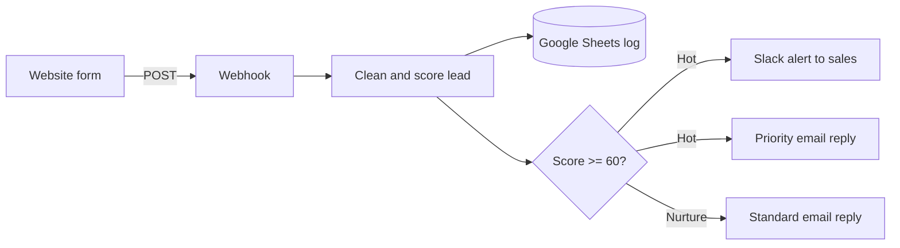

# n8n Lead Capture, Scoring & Follow-up

An n8n workflow that takes a new lead from a website form, scores it, logs it to Google Sheets, alerts the sales team on Slack when it is a hot lead, and replies to the lead by email, all within seconds and without manual work.

> **Status:** working end to end on a self-hosted n8n instance. Built as a portfolio project.

## The problem

Small businesses lose leads because inquiries sit unanswered and nobody can tell which ones are worth calling first. This workflow answers every lead immediately and flags the promising ones.

## How it works



1. **Webhook** receives the lead (`name`, `email`, `company`, `message`).
2. **Code node** cleans the fields and calculates a score from 0 to 100.
3. **Google Sheets** appends every lead as a row, including score and status.
4. **IF node** splits leads at a score of 60.
5. **Hot leads** trigger a Slack message and a priority email.
6. **Other leads** get a standard "we'll reply in 1-2 business days" email and are marked `Nurture`.

## Scoring rules

The score is rule-based (no AI, no API cost) and easy to change in the Code node.

| Signal | Points |
|---|---|
| Company name provided | +20 |
| Business email domain (not Gmail, Yahoo, etc.) | +25 |
| Message longer than 80 characters | +15 |
| Buying keywords (quote, pricing, budget, demo, urgent, ...) | +15 each, max +40 |

Total is capped at 100. A score of 60 or more is a **Hot** lead.

## Tech stack

- [n8n](https://n8n.io) (self-hosted, Community Edition)
- Google Sheets and Gmail (OAuth2)
- Slack (bot token)
- Plain HTML/JavaScript contact form (`demo/contact-form.html`)

## Repository contents

```
workflow/lead-capture-workflow.json   n8n workflow (import this)
demo/contact-form.html                demo form that posts to the webhook
docs/                                 screenshots and demo video
```

## Setup

1. **Run n8n**, for example with `npx n8n` or Docker, and open `http://localhost:5678`.
2. **Create a Google Sheet** with a tab named `Leads` and these headers in row 1:
   `Received At | Name | Email | Company | Message | Score | Status`
3. **Import** `workflow/lead-capture-workflow.json` (Workflows, then the menu, then Import from file).
4. **Connect credentials** in n8n:
   - Google Sheets and Gmail: create an OAuth client in Google Cloud (enable the Sheets, Drive and Gmail APIs) and add n8n's redirect URL.
   - Slack: create a Slack app with the `chat:write` and `chat:write.public` scopes and use its bot token.
5. **Edit the nodes:** put your Sheet ID in the Google Sheets node, your channel in the Slack node, and your business name in the two email nodes.
6. **Publish** the workflow to activate the production webhook URL.

## Test it

```bash
curl -X POST "http://localhost:5678/webhook/new-lead" \
  -H "Content-Type: application/json" \
  -d '{"name":"Sara Khan","email":"sara@acme.com","company":"Acme Ltd","message":"We need a quote and pricing for a demo, budget is ready."}'
```

Expected result: a new row in the sheet with a score and the status `Hot`, a Slack alert, and a reply email to the lead address.

On Windows PowerShell, use:

```powershell
Invoke-RestMethod -Method Post -Uri "http://localhost:5678/webhook/new-lead" -ContentType "application/json" -Body '{"name":"Sara Khan","email":"sara@acme.com","company":"Acme Ltd","message":"We need a quote and pricing for a demo, budget is ready."}'
```

## Demo

<!-- Add after recording: -->
<!--  -->
<!-- Demo video: link here -->

## Known limitations

- It runs on `localhost`, so the webhook is only reachable while the machine is on. A public deployment needs an always-on server or a tunnel.
- Google OAuth apps in Testing mode expire their tokens after about 7 days, so the Google credential must be re-authorized or the app published.
- The webhook is open. For production, restrict CORS to the site's domain and add spam protection such as a CAPTCHA.
- Scoring is rule-based and basic. It does not use a language model.

## Possible improvements

- Use an LLM to classify intent and urgency and to draft the reply.
- Add a CRM step (HubSpot, Notion or Airtable).
- Add WhatsApp or SMS follow-up.
- Add error handling and a failure alert workflow.

## Author

Muhammad Abdullah · [GitHub](https://github.com/AbdullahSoftDev) · [LinkedIn](https://linkedin.com/in/abdullahsoftdev)
